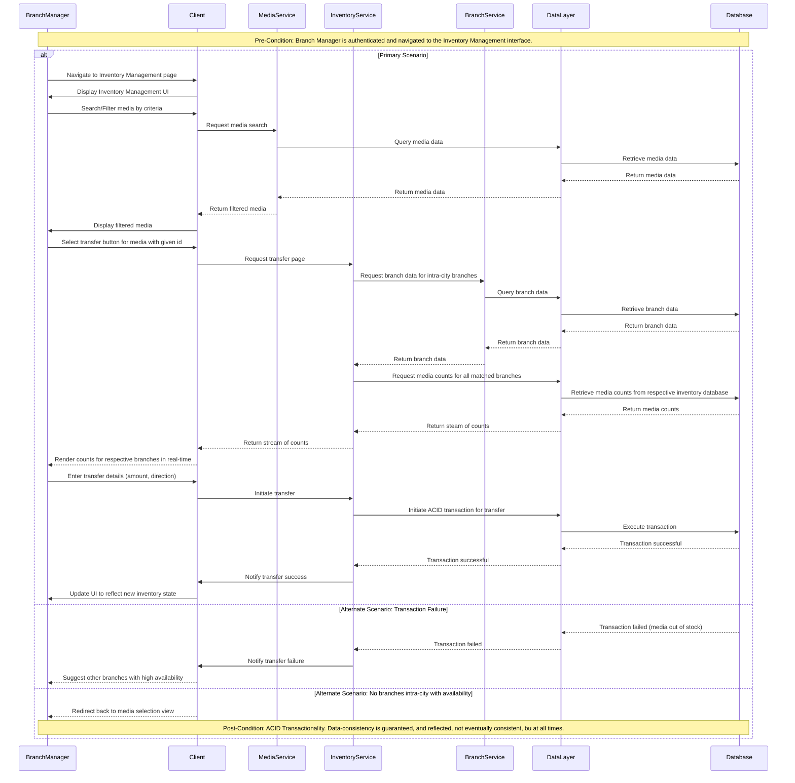
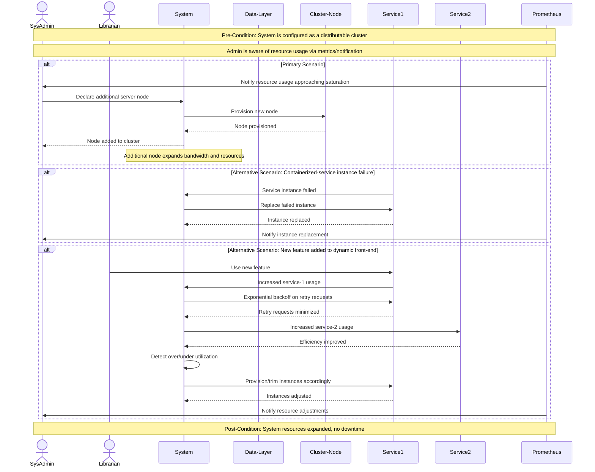
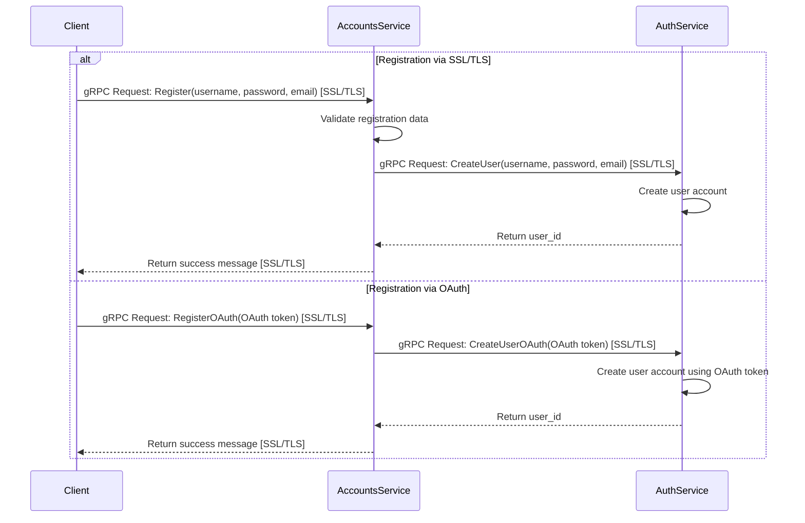
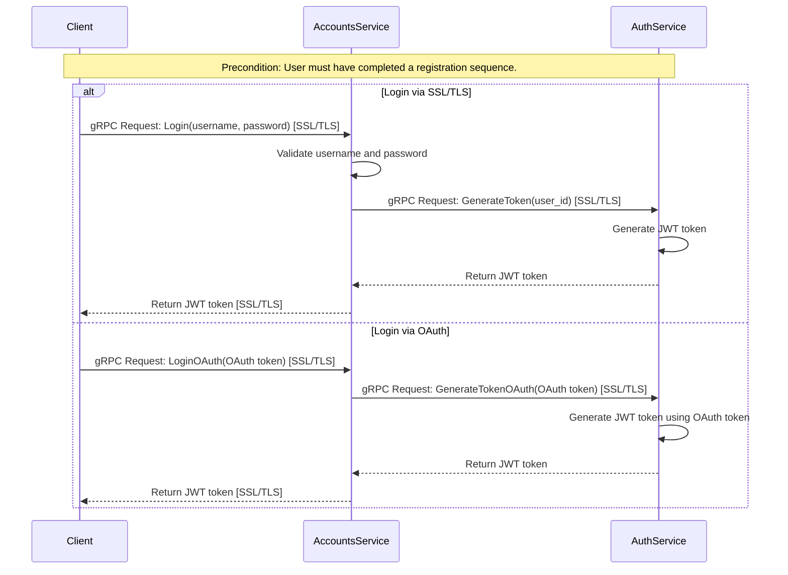

# Sequence Diagrams
## Inventory Management
Inventory Management Sequence Diagram with Additional Services
Below is a sequence diagram illustrating the inventory management process;
Including the primary and alternate scenarios, with additional services:

System Scalability:

Logging-in; Authentication Workflow -
Registration Sequence via SSL/TLS or Oauth:

Login Sequence via SSL/TLS or Oauth:

